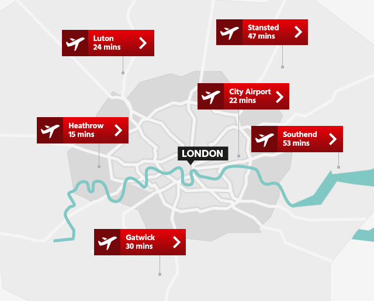

<section markdown="1">
# {{page.title}}

AppSec Europe will take place in London, United Kingdom, a dynamic and engaging city easily accessible from central Europe and most countries around the world.

## Traveling to London

### Plane

You can reach London by plane, from most major airports around Europe and the world.  London boasts three major airports that serve city and are on average within 1.5 hours drive to the city centre.

* [London Heathrow](https://www.heathrow.com/):  
Take the London Underground (Piccadilly line) to Central London and change at Hammersmith station for District line train to Upminster and get off at St. James's Park Station. QEII Centre is 4 minutes walk away.
You can also take Heathrow Express train which is faster, but more expensive than London Underground. Heathrow Express train will bring you to Paddington railway station. From there take the Circle Line of London Underground going via Victoria. Get off at St. James's Park Station. QEII Centre is 4 minutes walk away.

* [London City Airport](https://www.londoncityairport.com/):  
From London City Airport you can take the DLR train to Canning Town and change there for Jubilee line. Get off at Westminster station. QEII Centre is 7 minutes walk away.

* [Gatwick Airport](https://www.gatwickairport.com/):  
Gatwick Airport is located 24 miles south of Central London. To get to conference venue from Gatwick Airport you can:
1- Take the train to Victoria station and change there for eastbound District line to Upminster. Get off at St. James's Park Station. QEII Centre is 4 minutes walk away.
2- Take the train to Bedford and change at Blackfriars station to westbound District Line tube. Get off at St. James's Park Station. QEII Centre is 4 minutes walk away.

* [Southend Airport](https://southendairport.com/):  
Southend Airport is located 36 miles east of Central London. To get to the conference venue from Southend Airport you can take the train to London Liverpool Street station and change there for London Underground - Circle line. Get off at St. James's Park station. QEII Centre is 4 minutes walk away.

* [Stansted Airport](http://www.stanstedairport.com):  
Attendees can fly into London Stansted Airport (STN) which is located to the north-east of London.  Many low-cost airlines offer cheap flights between Stansted, Europe, and the Mediterranean.  Travelers can use the Stansted Express as the quickest way into central London with trains to London Liverpool Street taking 47 minutes.

* [Luton Airport](https://www.london-luton.co.uk/): 
London Luton Airport (LTN) is located to the north-west of central London. Many low-cost airlines offering cheap flights are based at Luton Airport. Luton Airport Parkway train station is 10 minutes from the airport by shuttle bus.Trains from Luton to central London take between 20 and 40 minutes.
To get to the conference venue from Luton airport you can take the shuttle bus (fare £2.30 cash only) to  Luton Airport Parkway station then take the Thameslink train to Blackfriars station and change there to westbound District Line on the London Underground (tube). Get off at St. James's Park Station. QEII Centre is 4 minutes walk away.

### Train

* EuroStar
Eurostar is the High speed train that has revolutionised travel between London and Europe since 1994.  Operating at 300km/h, it's just over 2 hours from the heart of Paris or from the centre of Brussels to St Pancras International in Central London via Eurostar. With a choice of frequent departures, fast check in and city centre to city centre locations, Eurostar is the ultimate European travel experience. Travelers can choose between flexibility in Business Premier, comfort in Standard Premier or seamlessness in Standard.

</section>

<section markdown="1">
## Traveling to the QEII Conference Centre

### London Tube System

London offers a very centrally connected [Tube Travel System](https://tfl.gov.uk/) making it easy and quick to travel through London to reach the QEII.  The tube stations located closest to the QEII are; Saint James Park and Westminster.   

Oyster Card: The most convenient way to pay for your public transport travel in London is Oyster card. Oyster is a smartcard which can be used to travel on London's buses, Tube, tram, DLR, London Overground and TFL Rail trains. You can buy Oyster cards from any London Underground (Tube) ticket machine by touching "Get new cards" button. Oyster card costs £5 which can be used towards travel. You can then either top up the credit on the Oyster card for “pay-as-you-go” option or buy a weekly travelcard (unlimited journey pass for one week) if you are going to stay in London the whole week. Please note that in Central London (travel zones 1 and 2)  a single journey on the Tube will cost you £2.40 and £1.50 on London buses. You can also travel on the Tubes & buses using most contactless credit/debit cards, however beware that not all US and European contactless cards are accepted.

### Taxi / Uber

London offers visitors a extensive taxi service.  All taxis accept credit card. Guests also have access to Uber in London in if they choose to use it.

### Walking

If your hotel is close by, it is also very safe to walk during the day to the QEII centre which is nicely located in the centre of London.

</section>
